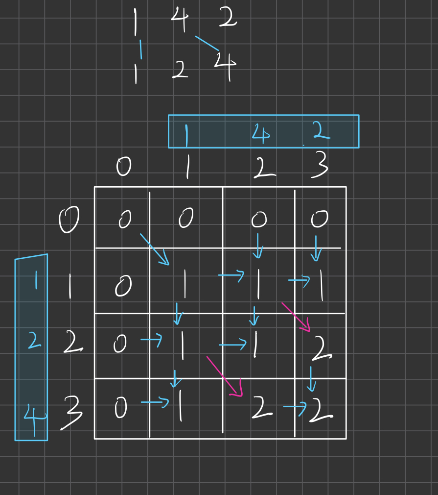
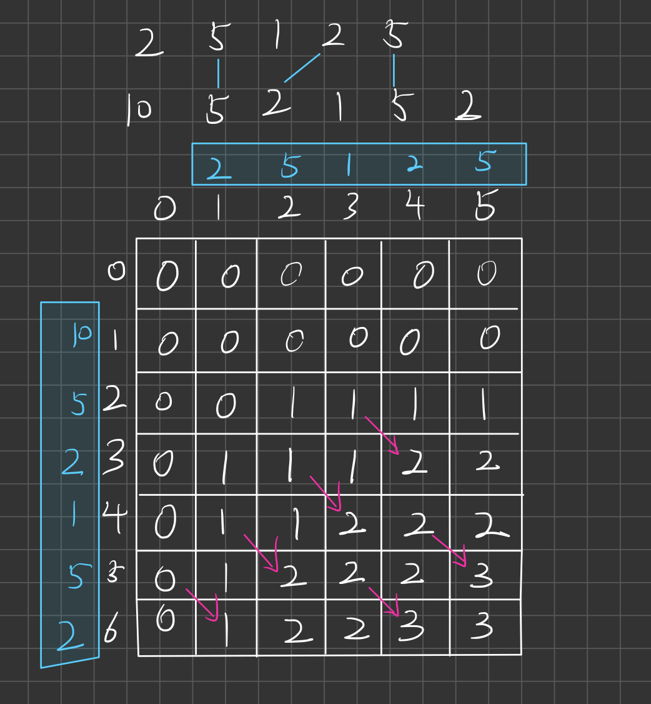

# 首先得用动态规划求解
**不要试着怎么去模拟，这样的话可能要暴力搜索很多种情况**，会超时.(我也没试过...). 

- 题目要求两条直线不相交，怎么才能不相交呢?

## 转化问题
不相交就得让相同数字的**相对顺序一样**，  
相对顺序一样不就是子序列吗，题目要求得到最多的连线，其实就是让我们求**最长子序列**.

## 动态规划解题
1.  本题有两个数组，因此选择建立二维dp数组解题比较方便一点,同时多增一列和一行便于公式推导.
    - dp[i][j] 就表示**数组A的子序列A[0~(i - 1)] 与 数组B的子序列[0~(j - 1)]的最大子序列长度**
  
2.  确定dp数组的状态转移方程.
    1. 当nums1[i - 1] = nums2[j - 1]，说明这两个字符相等，要做相应的操作.
    - ```dp[i][j] = dp[i - 1][j - 1] + 1```  即让子序列长度加1
    2. 当nums[i - 1] != nums2[j - 1], 说明这两个字符不想等，取之前最优解
    - ```dp[i][j] = max(dp[i - 1][j], dp[i][j - 1])```


$$
dp[i][j]=\begin{cases}
    dp[i - 1][j - 1] + 1 & nums1[i - 1] = nums2[j - 1]\\
    max(dp[i - 1][j], dp[i][j - 1]) & nums1[i - 1] \neq nums2[j - 1]
\end{cases}
$$

3.  确定遍历顺序
    - 从转移方程可以看出，当前这一步是从上面，左边，左上推导出来的.
    - 因此遍历顺序是**从上到下，从左到右.**

4.  确定上述几个条件后，我们会发现**每一行的最后一个元素都是最大的**，因此我们取右下角那个为答案.
    - 即 ```return dp[nums1.size()][nums2.size()]```

5. 可以尝试自己打印出dp数组，便于理解
- 这里我给出手画的dp数组.
  




## C++代码如下
```C++
int maxUncrossedLines(vector<int>& nums1, vector<int>& nums2) {
    int size1 = nums1.size();
    int size2 = nums2.size();
    vector<vector<int>> dp(size1 + 1, vector<int>(size2 + 1, 0)); //边缘多加一列一行，便于公式推导
    for (int i = 1; i < size1 + 1; i++) {
        for (int j = 1; j < size2 + 1; j++) {
            if (nums1[i - 1] == nums2[j - 1]) {
                dp[i][j] = dp[i - 1][j - 1] + 1;
            }
            else {
                dp[i][j] = max(dp[i - 1][j], dp[i][j - 1]);
            }
        }
    }
    return dp[size1][size2];
}
```