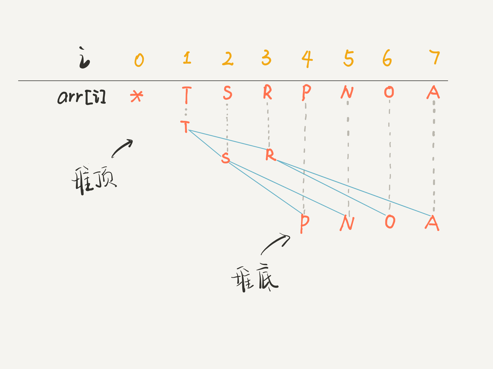

# 二叉堆
- 二叉堆就是一种**完全二叉树**，所以适合存储在数组中，而且二叉堆拥有一些特殊性质。
- **优先级队列**是基于**二叉堆**实现的，主要操作是插入和删除。插入是先插到最后，然后上浮到正确位置；删除是调换位置后再删除，然后下沉到正确位置.
### 主要操作
1. `swim`上浮
2. `sink`下沉

### 主要应用
1. 优先级队列
2. 堆排序

### 基本逻辑
```C++
// 父节点的索引
int parent(int root) {
    return root / 2;
}
// 左孩子的索引
int left(int root) {
    return root * 2;
}
// 右孩子的索引
int right(int root) {
    return root * 2 + 1;
}
```

- **映射图**


- **最大堆** 和 **最小堆**
最大堆: 每个结点都大于等于它的子结点.
最小堆: 每个结点都小于等于它的子结点.

### 核心操作实现(最大堆)
```C++
/* 辅助成员函数 */
private:
    bool compare(int a, int b) {
        return vec[a] < vec[b];
    }
    
    void exchange(int a, int b) {
        swap(vec[a], vec[b]);
    }
```
- 下沉
如果一个结点比他的子结点还小,他就要下沉,换那个大的来做父结点.
```C++
void sink(int k) {
    /* 下沉不要越界,还要换比较大的那一个 */
    while (left(k) < vec.size()) {
        int older = left(k);                                //假设左孩子大
        if (right(k) < vec.size() && compare(right(k), older))   //比较,看哪个大
            older = right(k);
        if (compare(k, older))                              //如果父结点比两个都大,就不用下沉了
            break;
        exchange(k, older);
        k = older;
    }
}
```
- 上浮
如果一个结点比他的父结点还大,他就要上浮，自己做父结点.
```C++
void swim(int k) {
    /* 到顶了就不能再上浮了 */
    while (k > 1 && compare(k, parent(k))) {
        exchange(k, parent(k));
        k = parent(k);
    }
}
```

### 增添和删除操作
- `insert`要先将新的元素添加到堆底的最后,再上浮到正确的位置.
```C++
void insert(int element) {
    vec.push_back(element);                     //增加元素
    swim(vec.size() - 1);                       //上浮到正确位置
}
```

- `del`要先将堆顶元素`A`与堆底最后元素`B`对调,然后删除`A`,再把`B`下沉到合适的位置.
```C++
int del() {
    int result = vec[1];                        //存储返回结果
    exchange(1, vec.size() - 1);                //和最后元素对调
    vec.pop_back();                             //删除最后一个元素
    sink(1);                                    //对调后的元素下沉到合适位置
    return result;
}
```

### 完整代码实现
```C++
class MyPriorityQueue {
public:
    MyPriorityQueue() : vec(vector<int>(1, - 100)) {}
    void insert(int ele) {
        vec.push_back(ele);
        swim(vec.size() - 1);
    }

    int del() {
        int result = vec[1];
        exchange(1, vec.size() - 1);
        vec.pop_back();
        sink(1);
        return result;
    }

    bool empty() {
        return vec.size() == 1;
    }

private:
    int parent(int k) {return k / 2;}
    int left(int k) {return k * 2;}
    int right(int k) {return k * 2 + 1;}
    bool compare(int a, int b) {return vec[a] < vec[b];}
    void exchange(int a, int b) {swap(vec[a], vec[b]);}

    void sink(int k) {
        while (left(k) < vec.size()) {
            int older = left(k);
            if (right(k) < vec.size() && compare(right(k), older))
                older = right(k);
            if (compare(k, older))
                break;
            exchange(k, older);
            k = older;
        }
    }

    void swim(int k) {
        while (k >= 1 && compare(k, parent(k))) {
            exchange(k, parent(k));
            k = parent(k);
        }
    }

private:
    vector<int> vec;
};
```