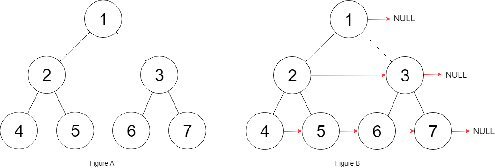
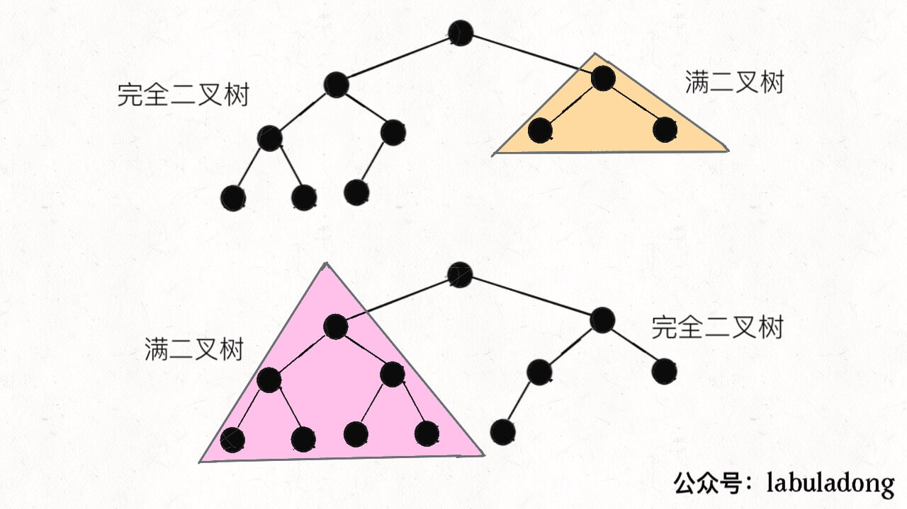

# 二叉树问题
### 核心难点 : 如何把题目的要求细化成每个节点需要做的事情.

**把题目的要求细化，搞清楚根节点应该做什么，然后剩下的事情抛给前/中/后序的遍历框架**

---

- **翻转二叉树**
```C++
class Solution {
public:
    TreeNode* invertTree(TreeNode* root) {
        help(root);
        return root;
    }

private:
    void help(TreeNode *root) {
        if (root == nullptr)
            return;
        swap(root->left, root->right);
        help(root->left);
        help(root->right);
    }
};
```

---

- **填充右侧结点**
**递归做法使用单一结点无法连接不同父结点的两个结点，因此需要操作两个结点才能完成题目要求**
```C++
class Solution {
public:
    Node* connect(Node* root) {
        if (root == nullptr)
            return nullptr;
        connect_imp(root->left, root->right); //使用两个结点完成递归操作
        return root;
    }

private:
    void connect_imp(Node *node1, Node *node2) {
        if (node1 == nullptr || node2 == nullptr) {
            return;
        }
        node1->next = node2; //两个结点进行连接
        //两个结点的各自字结点进行连接
        connect_imp(node1->left, node1->right);
        connect_imp(node2->left, node2->right);
        //两个结点的字结点跨父结点进行连接
        connect_imp(node1->right, node2->left);
    }
};
```



---

**层序遍历进行链接，使用广度优先算法**
```C++
class Solution {
public:
    void DFS(Node *root,vector<vector<Node*>>& vec) {
        if(root == nullptr)
            return;
        queue<Node*> q;
        q.push(root);
        while(!q.empty()) {
            int size = q.size();
            vector<Node*> temp;
            for(int i = 0 ; i < size ; i++) {
                if(q.front()->left) {
                    q.push(q.front()->left);
                }
                if(q.front()->right) {
                    q.push(q.front()->right);
                }
                temp.push_back(q.front());
                q.pop();
            }
            vec.push_back(temp);
        }
    }

    void Fill_Node(vector<vector<Node*>>& vec) {
        for(int i = 0 ; i < vec.size() ; i++) 
            for(int j = 0 ; j < vec[i].size() ; j++) {
                if(j == vec[i].size() -1) {
                    vec[i][j]->next = nullptr;
                    break;
                }
                vec[i][j]->next = vec[i][j+1];
            }
    }

    Node* connect(Node* root) {
        vector<vector<Node*>> vec;
        DFS(root,vec);
        Fill_Node(vec);
        return root;
    }
};
```

---

- **二叉树展开为链表**
*浅层拼接和深层拼接操作*
```C++
class Solution {
public:
    void flatten(TreeNode* root) {
        if (root == nullptr)
            return;

        //用后序遍历整活
        flatten(root->left);
        flatten(root->right);
        
        //保存左右子树
        TreeNode *left = root->left;
        TreeNode *right = root->right;

        //简单拼接,左子树扁平化
        root->left = nullptr;
        root->right = left;

        //深层扁平化,拼接原右子树
        TreeNode *p = root;
        while (p->right)
            p = p->right;
        p->right = right;
    }
};
```

---

- **构建最大二叉树**
*关键是寻找中间分割点，进行左右子树的构建操作*
```C++
class Solution {
public:
    TreeNode* constructMaximumBinaryTree(vector<int>& nums) {
        return constructTree(nums, 0, nums.size() - 1);
    }

private:
    TreeNode* constructTree(vector<int> &nums, int left, int right) {
        if (left > right)
            return nullptr;
        int indexMax = left;
        int maxNum = nums[left];
        //寻找中间分割点
        for (int i = left; i <= right; ++i) {
            if (nums[i] > maxNum) {
                maxNum = nums[i];
                indexMax = i;
            }
        }
        
        //构建结点
        TreeNode *root = new TreeNode(maxNum);
        //进行左右子树之分割操作
        root->left = constructTree(nums, left, indexMax - 1);
        root->right = constructTree(nums, indexMax + 1, right);

        return root;
    }
};
```

---

- **前序和中序构造二叉树**
```C++
class Solution {
public:
    TreeNode* buildTree(vector<int>& preorder, vector<int>& inorder) {
        return construct(preorder, 0, preorder.size() - 1, inorder, 0, inorder.size() - 1);
    }

private:
    TreeNode* construct(vector<int>& preorder, int left_p, int right_p,
                        vector<int>& inorder, int left_i, int right_i) {
        if (left_p > right_p)
            return nullptr;

        //获得当前根结点和寻求分割点的索引位置
        int curRoot = preorder[left_p];
        int index = left_i;
        for (int i = left_i; i <= right_i; ++i) {
            if (curRoot == inorder[i]) {
                index = i;
                break;
            }
        }
        int distance = index - left_i; //求得距离
        TreeNode *root = new TreeNode(curRoot);
        root->left = construct(preorder, left_p + 1, left_p + distance, inorder, left_i, index - 1);
        root->right = construct(preorder, left_p + distance + 1, right_p, inorder, index + 1, right_i);

        return root;
    }
};
```

---

- **中序遍历和后序遍历构造二叉树**
```C++
class Solution {
public:
    TreeNode* buildTree(vector<int>& inorder, vector<int>& postorder) {
        return constructTree(inorder, 0, inorder.size() - 1, postorder, 0, postorder.size() - 1);
    }

private:
    TreeNode* constructTree(vector<int> &inorder, int left_i, int right_i,
                            vector<int> &postorder, int left_p, int right_p) {
        if (left_p > right_p)
            return nullptr;

        //寻找分割点
        int curRoot = postorder[right_p];
        int index = left_i;
        for (int i = left_i; i <= right_i; ++i) {
            if (inorder[i] == curRoot) {
                index = i;
                break;
            }
        }

        //点位分割
        int distance = index - left_i;
        TreeNode *root = new TreeNode(curRoot); //构造结点
        root->left = constructTree(inorder, left_i, index - 1, postorder, left_p, left_p + distance - 1);
        root->right = constructTree(inorder, index + 1, right_i, postorder, left_p + distance, right_p - 1);
        return root;
    }
};
```

----

- **652 寻找重复子树**
```C++
class Solution {
public:
    vector<TreeNode*> findDuplicateSubtrees(TreeNode* root) {
        travel(root);
        return result;
    }

    //序列化辅助函数
    string travel(TreeNode *root) {
        if (root == nullptr)
            return "x";

        //序列化过程
        string left = travel(root->left);
        string right = travel(root->right);
        string cur = left + "," + right + "," + to_string(root->val);

        //查找是否重复出现
        if (Hash[cur] == 1) {
            result.push_back(root);
            Hash[cur]++;
        }
        else 
            Hash[cur]++;
        return cur;
    }

private:
    unordered_map<string, int> Hash; //记录序列化出现次数
    vector<TreeNode*> result;        //结果集
};
```

---

- **二叉树的序列化和反序列化**
**PS:** *一般语境下，单单前序遍历结果是不能还原二叉树结构的，因为缺少空指针的信息，至少要得到前、中、后序遍历中的两种才能还原二叉树。但是这里的 node 列表包含空指针的信息，所以只使用 node 列表就可以还原二叉树。*
- **先序遍历**
```C++
//序列化二叉树
string serialize(TreeNode *root) {
    string result = "";
    serialize(root, result);
    return result;
}

void serialize(TreeNode *root, string &result) {
    if (root == nullptr) {
        result.push_back('#');
        result.push_back(',');
    }
    result += to_string(root->val);

    serialize(root, result);
    serialize(root, result);
}
```

```C++
//反序列化二叉树(此码有误)
TreeNode* deserialize(TreeNode *root, string &result) {
    list<string> vec;
    for (int i = 0; i < result.size(); ++i) {
        if (result[i] == ',')
            continue;
        vec.push_back(result[i]);
    }
    return deserilize(vec);
}

TreeNode* deserialize(list<string> &vec) {
    if (vec.empty())
        return nullptr;
    char first = vec.front();
    vec.pop_front();
    if (first == '#')
        return nullptr;
    TreeNode *newNode = new TreeNode(first - '0');

    newNode->left = deserialize(vec);
    newNode->right = deserialize(vec);

    return newNode;
}
```

- **后序遍历**
类似于先序遍历，但是根结点在结尾，而且先构造右子树.

- **中序遍历**
中序遍历可以序列化，但是无法进行反序列化.

- **层序遍历**
```JAVA
String SEP = ",";
String NULL = "#";

/* 将二叉树序列化为字符串 */
String serialize(TreeNode root) {
    if (root == null) return "";
    StringBuilder sb = new StringBuilder();
    // 初始化队列，将 root 加入队列
    Queue<TreeNode> q = new LinkedList<>();
    q.offer(root);

    while (!q.isEmpty()) {
        TreeNode cur = q.poll();

        /* 层级遍历代码位置 */
        if (cur == null) {
            sb.append(NULL).append(SEP); //处理空结点
            continue;
        }
        sb.append(cur.val).append(SEP);
        /*****************/

        q.offer(cur.left);
        q.offer(cur.right);
    }

    return sb.toString();
}
```

```JAVA
/* 将字符串反序列化为二叉树结构 */
TreeNode deserialize(String data) {
    if (data.isEmpty()) return null;
    String[] nodes = data.split(SEP);
    // 第一个元素就是 root 的值
    TreeNode root = new TreeNode(Integer.parseInt(nodes[0]));

    // 队列 q 记录父节点，将 root 加入队列
    Queue<TreeNode> q = new LinkedList<>();
    q.offer(root);

    for (int i = 1; i < nodes.length; ) {
        // 队列中存的都是父节点
        TreeNode parent = q.poll();
        // 父节点对应的左侧子节点的值
        String left = nodes[i++];
        if (!left.equals(NULL)) {
            parent.left = new TreeNode(Integer.parseInt(left));
            q.offer(parent.left); //左子树加入队列
        } else {
            parent.left = null;
        }
        // 父节点对应的右侧子节点的值
        String right = nodes[i++];
        if (!right.equals(NULL)) {
            parent.right = new TreeNode(Integer.parseInt(right));
            q.offer(parent.right); //右子树加入队列
        } else {
            parent.right = null;
        }
    }
    return root;
}
```

---

### 前序遍历序列化和反序列化
```C++
class Codec {
public:

    // Encodes a tree to a single string.
    string serialize(TreeNode* root) {
        string result;
        serialize_(root, result);
        return result;
    }

    //前序序列化核心代码
    void serialize_(TreeNode *root, string &result) {
        if (!root) {
            result += "#,";
            return;
        }

        result += to_string(root->val) + ",";
        serialize_(root->left, result);
        serialize_(root->right, result);
    }

    // Decodes your encoded data to tree.
    TreeNode* deserialize(string data) {
        list<string> lst;
        string temp;
        //转化成列表
        for (int i = 0; i < data.size(); ++i) {
            if (data[i] == ',') {
                lst.push_back(temp);
                temp = "";
            }
            else
                temp.push_back(data[i]);
        }
        return deserialize_(lst);
    }

    //前序反序列化核心代码
    TreeNode* deserialize_(list<string> &lst) {
        if (lst.empty())
            return nullptr;
        
        string cur = lst.front(); //第一个是根结点
        lst.pop_front();
        if (cur == "#")
            return nullptr;
        
        TreeNode *root = new TreeNode(stoi(cur));
        root->left = deserialize_(lst);
        root->right = deserialize_(lst);

        return root;
    }
};
```

### 后序遍历序列化和反序列化
```C++
class Codec {
public:

    // Encodes a tree to a single string.
    string serialize(TreeNode* root) {
        string result;
        serialize_(root, result);
        return result;
    }

    //后序遍历序列化核心代码
    void serialize_(TreeNode *root, string &result) {
        if (!root) {
            result += "#,";
            return;
        }

        serialize_(root->left, result);
        serialize_(root->right, result);
        result += to_string(root->val) + ",";
    }

    // Decodes your encoded data to tree.
    TreeNode* deserialize(string data) {
        list<string> lst;
        string temp;
        //转化成列表
        for (int i = 0; i < data.size(); ++i) {
            if (data[i] == ',') {
                lst.push_back(temp);
                temp = "";
            }
            else
                temp.push_back(data[i]);
        }
        return deserialize_(lst);
    }

    //后序遍历反序列化核心代码
    TreeNode* deserialize_(list<string> &lst) {
        if (lst.empty())
            return nullptr;
        
        string cur = lst.back(); //最后一个为跟结点
        lst.pop_back();
        if (cur == "#")
            return nullptr;
        
        TreeNode *root = new TreeNode(stoi(cur));
        root->right = deserialize_(lst); //先右后左
        root->left = deserialize_(lst);
        return root;
    }
};
```

---

- **236二叉树的共同祖先(重点)** 
```C++
class Solution {
public:
    TreeNode* lowestCommonAncestor(TreeNode* root, TreeNode* p, TreeNode* q) {
        if (!root)
            return nullptr;
        if (root == p || root == q)
            return root;

        TreeNode *l = lowestCommonAncestor(root->left, p, q);
        TreeNode *r = lowestCommonAncestor(root->right, p, q);

        if (l && r)
            return root;
        if (!l && !r)
            return nullptr;
        return l ? l : r;
    }
};
```


---

- **计算完全二叉树结点数量**
```C++
class Solution {
public:
    int countNodes(TreeNode* root) {
        int lH = 0; TreeNode *l = root;
        int rH = 0; TreeNode *r = root;
        while (l) {
            lH++;
            l = l->left;
        }

        while (r) {
            rH++;
            r = r->right;
        }

        if (lH == rH) {
            return pow(2, lH) - 1;
        }

        //满二叉树和普通二叉树结合运算，其中有一个肯定是满二叉树，一次遍历即可
        return 1 + countNodes(root->left) + countNodes(root->right);
    }
};
```

