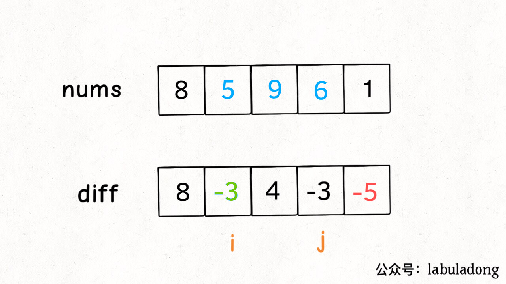

# 前缀和

- **560 和为k的子数组** 
思考点：肯定使用前缀减去前缀，否则数组是不连续的.通过哈希表记录前缀和出现的次数直接相加，降低时间复杂度.
```C++
class Solution {
public:
    /*
     * 思路:首先想到前缀和
     * 解法一是得到前缀和后两层循环遍历,得到一次就加入到一次结果,事件复杂度O(n^2)
     * 解法二用哈希表记录前缀和次数,加入结果时一次性加入次数，时间复杂度O(n).
     */
    int subarraySum(vector<int>& nums, int k) {
        int result = 0;
        int sum0_i = 0;
        unordered_map<int, int> record;
        record[0] = 1;                        //记得加入0，当数组只有一个元素时的极端情况
        for (int i = 0; i < nums.size(); ++i) {
            sum0_i += nums[i];
            int sum0_j = sum0_i - k;
            if (record.count(sum0_j))
                result += record[sum0_j];     //直接把前面有多少个加入结果,不用一次次加
            record[sum0_i]++;
        }
        return result;
    }
};
```

### 467 环绕字符串中唯一的子字符串
- 注意去重，利用哈希表记录最大长度.

```C++
class Solution {
public:
    int findSubstringInWraproundString(string p) {
        map<char, int> mp;
        int cur = 1;
        p = "_" + p; //虚拟头元素
        for (int i = 1; i < p.size(); i++) {
            if (p[i] - p[i - 1] == 1 || p[i]- p[i - 1] == -25) //判断连续
                cur += 1;
            else 
                cur = 1;
            mp[p[i]] = max(cur, mp[p[i]]); //去重逻辑
        }
        int res = 0;
        for (auto i : mp) //子数组激情累加
            res += i.second;
        return res;
    }
};
```

### 795 区间子数组个数
- 利用差集求解
- 该题累加是计数器``cnt++``再``res += cnt``

```C++
class Solution {
public:
    int numSubarrayBoundedMax(vector<int>& nums, int left, int right) {
        return BoundMax(nums, right) - BoundMax(nums, left - 1); //求差集
    }

private:
    int BoundMax(vector<int> &nums, int bound) {
        int res = 0;
        int cnt = 0;
        for (int fast = 0; fast < nums.size(); fast++) {
            if (nums[fast] <= bound) //符合条件
                cnt++;
            else                    //不符合条件
                cnt = 0;
            res += cnt;
        }
        return res;
    }
};
```

## 差分数组
- **差分数组的主要适用场景是频繁对原始数组的某个区间的元素进行增减。**
- 构造差分数组 和 反推原数组
```C++
//构造
vector<int> diff(nums.size());
diff[0] = nums[0];
for (int i = 1; i < nums.size(); ++i)
    diff[i] = nums[i] - nums[i -1];

//反推
vector<int> origin(nums.size());
origin[0] = diff[0];
for (int i = 1; i < nums.size(); ++i)
    origin[i] = origin[i - 1] + diff[i];
```

- **区间快速增减**
想对`nums[i..j]`全部加3，只需要`diff[i] += 3`和`diff[j + 1] -= 3`


### 1109 航班座位预定
- **差额序列** + **前缀和** 求解
```C++
class Solution {
public:
    //差额运算
    vector<int> corpFlightBookings(vector<vector<int>>& bookings, int n) {
        vector<int> result(n, 0); //结果集
        for (auto booking : bookings) {
            result[booking[0] - 1] += booking[2]; //数组的下标和题目要求下标不同
            if (booking[1] < n) {                 //截止到下一位，累加时不算这一位，因此要减
                result[booking[1]] -= booking[2];
            }
        }
        for (int i = 1; i < result.size(); i++)   //前缀和累加
            result[i] += result[i - 1];
        return result;
    }
};
```

- **差分数组类求解**
```C++
//差分数组辅助类
struct DiffArray {
public:
    DiffArray(int n) : diff(vector<int>(n)) {}

    //O(1)时间复杂度之更改
    void change(int i, int j, int val) {
        diff[i] += val;
        if (j + 1 < diff.size())
            diff[j + 1] -= val;
    }

    //获得原始数组
    vector<int> getOrigin() {
        vector<int> result(diff.size());
        result[0] = diff[0];
        for (int i = 1; i < diff.size(); ++i) 
            result[i] = result[i - 1] + diff[i];
        return result;
    }

private:
    vector<int> diff;
};

class Solution {
public:
    vector<int> corpFlightBookings(vector<vector<int>>& bookings, int n) {
        DiffArray diffArray(n);
        for (int i = 0; i < bookings.size(); ++i) {
            //索引转换，题目是从1开始的
            int left = bookings[i][0] - 1;
            int right = bookings[i][1] - 1;
            int value = bookings[i][2];
            diffArray.change(left, right, value);
        }
        return diffArray.getOrigin();
    }
};
```

### 303 区域的检索-数组不变
- 前缀和优化问题
```C++
class NumArray {
public:
    NumArray(vector<int>& nums) : preSum(vector<int>(nums.size(), 0)){
        if (nums.size() > 0)
            preSum[0] = nums[0];
        for (int i = 1; i < nums.size(); i++) {
            preSum[i] = nums[i] + preSum[i - 1];
        }
    }
    
    int sumRange(int left, int right) {
        if (left == 0)
            return preSum[right];
        return preSum[right] - preSum[left - 1];
    }

private:
    vector<int> preSum;
};
```

### 1171 删除连续和为0的结点
- 连续问题，又有负数，考虑前缀和.
- 前缀和的差额思想，如果**出现重复的前缀和**，则肯定有**负数抵消的之前的增额**，**存在和为0的连续子序列**.

```C++
class Solution {
public:
    ListNode* removeZeroSumSublists(ListNode* head) {
        ListNode *dummy_head = new ListNode(0, head); //虚拟头结点，内值为0，防止一整个链表和为0的情况
        unordered_map<int, ListNode*> hashMap;
        int curSum = 0;
        for (ListNode *p = dummy_head; p != nullptr; p = p->next) { //哈希表记录前缀和
            curSum += p->val;
            hashMap[curSum] = p;
        }
        curSum = 0;
        for (ListNode *p = dummy_head; p != nullptr; p = p->next) { //差额数组算法
            curSum += p->val;
            p->next = hashMap[curSum]->next;
        }
        return dummy_head->next;
    }
};
```

### 总结
- 找关键字，出现 **连续** 字眼就想到前缀和和滑动窗口. 出现最大值最小值就联想到动态规划.
- 写出暴力解，再想想用什么方法去优化问题.