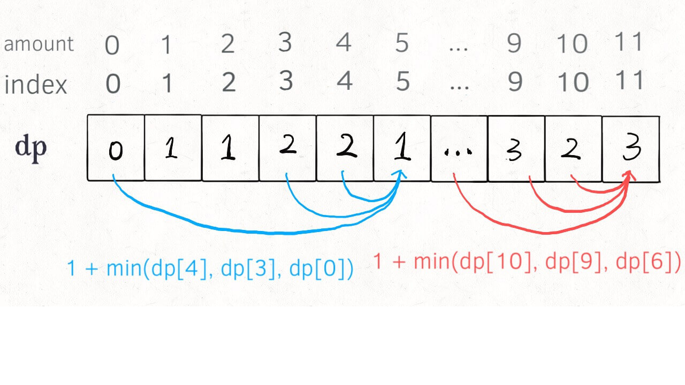
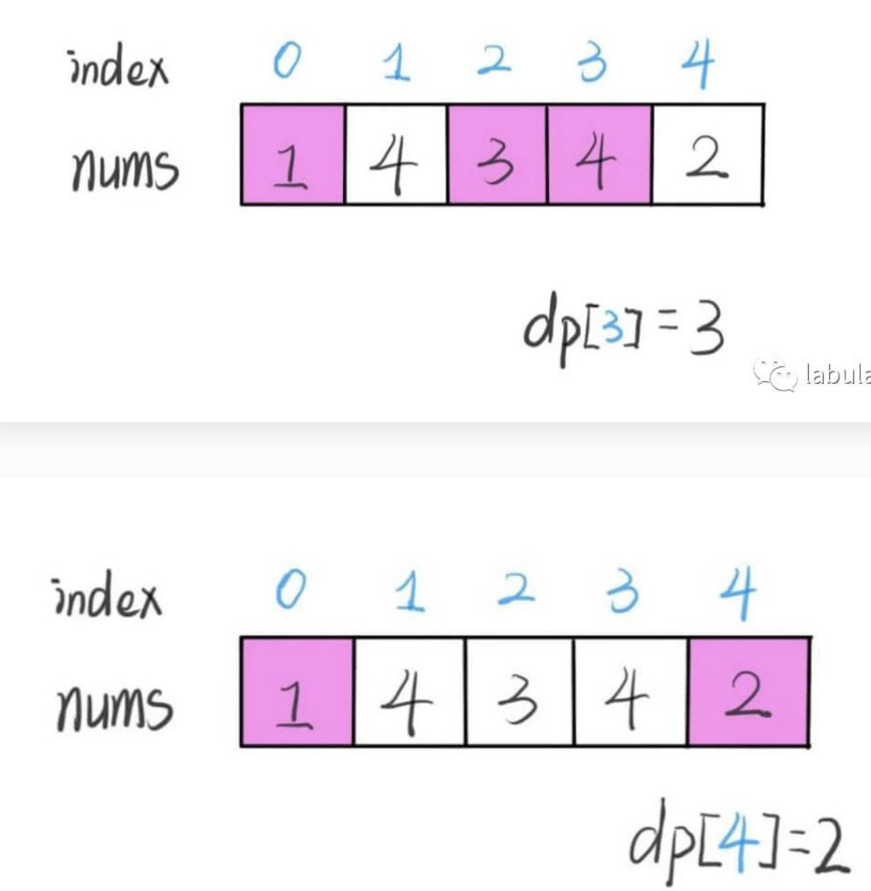
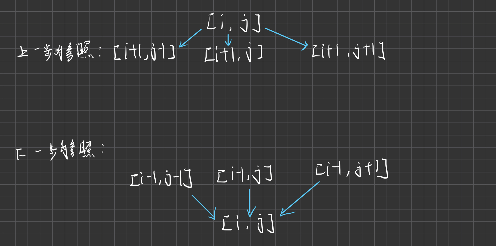
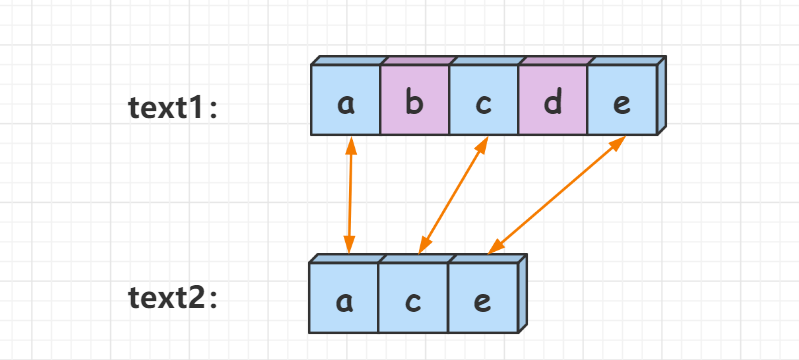
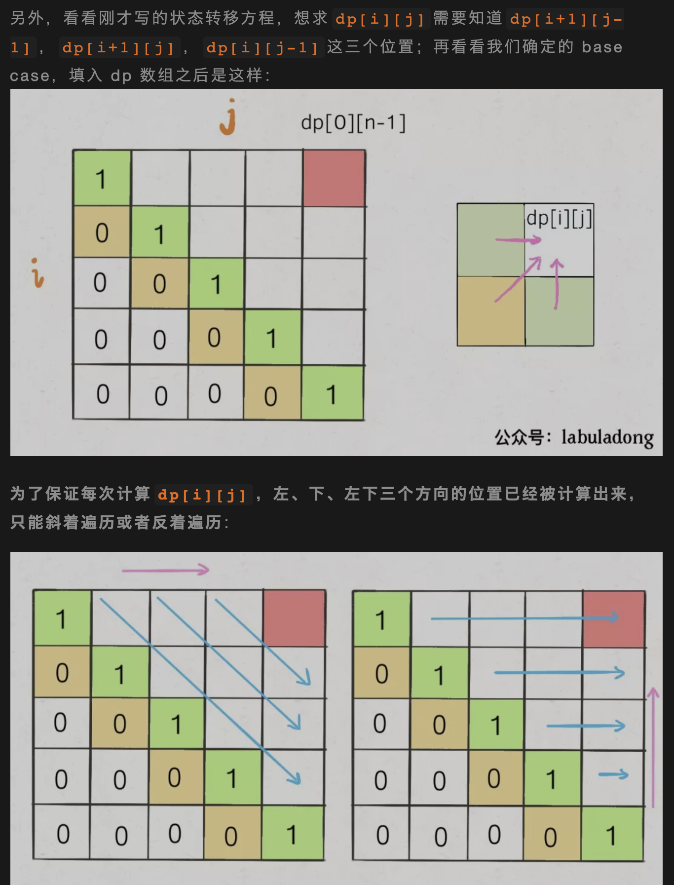

# 动态规划
- **基本思路: 明确 base case -> 明确「状态」-> 明确「选择」 -> 定义 dp 数组/函数的含义。**
- **「最值」问题**考虑用动态规划解决.
- 动态规划主要解决了 **「重叠子问题」** , 从而压缩时间复杂度.
- **基本框架：**
```Python
# 初始化 base case
dp[0][0][...] = base
# 进行状态转移
for 状态1 in 状态1的所有取值：
    for 状态2 in 状态2的所有取值：
        for ...
            dp[状态1][状态2][...] = 求最值(选择1，选择2...)
```
- **动态规划一般是自底向上,从基本情况往后推,一般用迭代实现.而递归一般是自顶向下的.**

### 状态转移
- **通过前面的状态推导出现在的状态**,典型例题的**斐波那契数列**.
```C++
class Solution {
public:
    int fib(int n) {
        if (n == 0) return 0;
        int dp[n + 1];
        dp[0] = 0;
        dp[1] = 1;
        for (int i = 2; i <= n; ++i)
            dp[i] = dp[i - 1] + dp[i -2];
        return dp[n];
    }
};
```

### 状态压缩
- **使用状态压缩技巧对二维`dp`数组进行降维打击之后，解法代码的可读性变得非常差了，如果直接看这种解法，任何人都是一脸懵逼的。算法的优化就是这么一个过程，先写出可读性很好的暴力递归算法，然后尝试运用动态规划技巧优化重叠子问题，最后尝试用状态压缩技巧优化空间复杂度.**

### 最优子结构
- **要符合「最优子结构」，子问题间必须互相独立.**
- *dp 数组的定义：当目标金额为 i 时，至少需要 dp[i] 枚硬币凑出。*
- **零钱兑换**
```C++
class Solution {
public:
    int coinChange(vector<int>& coins, int amount) {
        vector<int> dp(amount + 1, amount + 1);
        dp[0] = 0;                      //base case: 零元肯定只需要零枚硬币.
        for (int i = 0; i <= amount; ++i) {
            for (int coin : coins) {
                if (i - coin < 0)       //此时无解,比如要凑3元,一个5元肯定不能塞下去
                    continue;
                dp[i] = min(dp[i], dp[i - coin] + 1);  //取最优解,dp[i]可能会被多次覆盖取最优
            }
        }
        return (dp[amount] == amount + 1)? -1 : dp[amount];
    }
};
```


### 经典问题之「最长递增子序列(LIS)」
- 这类问题**不是连续的子序列,因此不能用滑动窗口.**
- 动态规划解法时间复杂度 **$O(n^2)$**.
- 解题思路:
  1. **`dp[i]` 表示以 `nums[i]` 这个数结尾的最长递增子序列的长度.**
  2. 根据定义,设定初始值最长长度就是它自己,即`dp[i]` = 1.

```C++
class Solution {
public:
    int lengthOfLIS(vector<int>& nums) {
        vector<int> dp(nums.size(), 1);             //base case: 每个子序列都取最短,即他本身.
        int result = 1;
        for (int i = 1; i < nums.size(); ++i) {
            for (int j = 0; j < i; ++j) {
                if (nums[i] > nums[j])
                    dp[i] = max(dp[i], dp[j] + 1);  //取最优解
                result = max(result, dp[i]);        //得当前最大的结果
            }
        }
        return result;
    }
};
```

- **俄罗斯套娃信封问题**
- 这题可以抽象成 **「LIS」** 问题,不过是两个维度的比较.需要自定义排序规则然后套用动态规划最长递增子序列模板.
```C++
class Solution {
public:
    int maxEnvelopes(vector<vector<int>>& envelopes) {
        int result = 1;
        mySort(envelopes);                      //二纬排序,接下来就是LIS问题了
        vector<int> dp(envelopes.size(), 1);
        for (int i = 1; i < envelopes.size(); ++i) {
            for (int j = 0; j < i; ++j) {
                if (envelopes[i][0] > envelopes[j][0] && envelopes[i][1] > envelopes[j][1])
                    dp[i] = max(dp[i], dp[j] + 1);
                result = max(result, dp[i]);
            }
        }
        return result;
    }

private:
    //自定义排序
    void mySort(vector<vector<int>> &envelopes) {
        auto comp = [](vector<int> &a, vector<int> &b) {
            if (a[0] < b[0])
                return true;
            else if (a[0] == b[0])
                return a[1] < b[1];
            else
                return false;
        };
        sort(envelopes.begin(), envelopes.end(), comp);
    }
};
```

---

### 下降路径的最小和
```C++
class Solution {
public:
    /*
     * 思路: 动态规划
     * 选择参照物,从上往下,从左往右遍历.
     * 我选择的参照物是当前位置,由上一步位置来确定.也可以选择当前推导下一位.
     */ 
    int minFallingPathSum(vector<vector<int>>& matrix) {
        vector<vector<int>> dp(matrix.size(), vector<int>(matrix[0].size(), 1000000)); //dp数组
        dp[0] = matrix[0];                                                          //base case
        for (int i = 1; i < matrix.size(); ++i) {
            for (int j = 0; j < matrix[0].size(); ++j) {
                vector<int> temp{j - 1, j, j + 1};                                  //推导方向
                for (int k : temp) {
                    if (k >= 0 && k < matrix[0].size())
                        dp[i][j] = min(dp[i][j], dp[i - 1][k] + matrix[i][j]);      //取最优解
                }
            }
        }
        return *min_element(dp.back().begin(), dp.back().end());                    //找最优解
    }
};
```


---

#### 回溯和动态规划比较
- **目标和问题**
```C++
// 回溯法(未加备忘录超时)
class Solution {
public:
    //回溯选择 +1 和 -1.
    int findTargetSumWays(vector<int>& nums, int target) {
        result = 0; path = target;
        backTrace(nums, 0);
        return result;
    }

    void backTrace(vector<int> &nums, int start_index) {
        if (start_index == nums.size()) {
            if (path == 0)
                result++;
            return;
        }

        path += nums[start_index];
        backTrace(nums, start_index + 1);
        path -= nums[start_index];

        path -= nums[start_index];
        backTrace(nums, start_index + 1);
        path += nums[start_index];
    }

private:
    int result;
    int path;
};
```
- 回溯法存在 **「重叠子问题」**.
只要我们能够找到一个重叠子问题，那一定还存在很多的重叠子问题。
```C++
void backtrack(int i, int rest) {
    backtrack(i + 1, rest - nums[i]);
    backtrack(i + 1, rest + nums[i]);
}
/*当 nums[i] == 0 时有 */
void backtrack(int i, int rest) {
    backtrack(i + 1, rest);
    backtrack(i + 1, rest);
}
/* 两个计算完全相同 */
```

- **动态规划解法:**
```C++
#define WaitingCode
```

---

#### 最长公共子序列(LCS)经典问题
- 给定两个字符串 `text1` 和 `text2`，返回这两个字符串的最长 **「公共子序列」** 的长度 (子序列可以不连续)。

- **定义状态:** `dp[i][j]` 表示 `text1[1, i]` 和 `text2[1, j]` 的最长子序列长度.
- **base case:** 为了好计算，引入一个空字符串LCS长度，即0.
- **状态转移推导:**
当`text1[i] == text2[j]`时, `text[1 : i - 1]`和`text2[1 : j - 1]`的最长子序列加长一位.所以有状态转移方程:`dp[i][j] = dp[i - 1][j - 1] + 1`.
当`text1[i] != text2[j]`时, 最长子序列无法延长,这时就要选 **「最优子结构」**, 取一个最长的，因此有状态转移方程:`dp[i][j] = max(dp[i - 1][j], dp[i][j - 1])`.
- **代码实现**
```C++
class Solution {
public:
    int longestCommonSubsequence(string text1, string text2) {
        int str_len1 = text1.size(), str_len2 = text2.size();
        vector<vector<int>> dp(str_len1 + 1, vector<int>(str_len2 + 1, 0));
        for (int i = 1; i <= str_len1; ++i) {
            for (int j = 1; j <= str_len2; ++j) {
                if (text1[i - 1] == text2[j - 1])               //延长最长子串
                    dp[i][j] = dp[i - 1][j - 1] + 1;
                else
                    dp[i][j] = max(dp[i - 1][j], dp[i][j - 1]); //选择最优的
            }
        }
        return dp[str_len1][str_len2];
    }
};
```

- **583 两个字符串的删除操作**
当成为 **「公共子序列」** 的时候所需步数是最少的,因此只需要计算各自字符串到 **「LCS」** 只需要几步即可.
- **代码实现**
```C++
class Solution {
public:
    int minDistance(string word1, string word2) {
        int n = word1.size(), m = word2.size();
        vector<vector<int>> dp(n + 1, vector<int>(m + 1, 0));
        for (int i = 1; i <= n; ++i) {
            for (int j = 1; j <= m; ++j) {
                if (word1[i - 1] == word2[j - 1])
                    dp[i][j] = dp[i - 1][j - 1] + 1;
                else
                    dp[i][j] = max(dp[i - 1][j], dp[i][j - 1]);
            }
        }
        int lcs = dp[n][m];
        return n + m - 2 * lcs;
    }
};
```

- **两个字符串的最小ASCILL删除和**
和之前差不多,这次直接统计 **「LCS」** 的 ASCII码和.
- **代码实现**
```C++
class Solution {
public:
    int minimumDeleteSum(string s1, string s2) {
        int n = s1.size(), m = s2.size();
        vector<vector<int>> dp(n + 1, vector<int>(m + 1, 0));
        for (int i = 1; i <= n; ++i) {
            for (int j = 1; j <= m; ++j) {
                if (s1[i - 1] == s2[j - 1])
                    dp[i][j] = dp[i - 1][j - 1] + s1[i - 1];
                else
                    dp[i][j] = max(dp[i - 1][j], dp[i][j - 1]);
            }
        }
        int sum1 = calculate(s1);
        int sum2 = calculate(s2);
        int lcs = dp[n][m];
        return sum1 + sum2 - 2 * lcs;
    }

private:
    int calculate(string &s) {
        int sum = 0;
        for (char c : s)
            sum += c;
        return sum;
    }
};
```

---

### 经典问题之「编辑距离」
- 与 **「最长公共子序列」** 的删除问题不同， **「编辑距离」** 提供了三种操作，即 **「增删改」**.
- **DP_Table**

- **关系图(相对于i而言)**

- **代码实现**
```C++
class Solution {
public:
    int minDistance(string word1, string word2) {
        int n = word1.size(), m = word2.size();
        vector<vector<int>> dp(n + 1, vector<int>(m + 1, 0));
        baseCase(dp, n, m);                           //初始化,对应空字符的情况

        for (int i = 1; i <= n; ++i) {
            for (int j = 1; j <= m; ++j) {
                if (word1[i - 1] == word2[j - 1]) {
                    dp[i][j] = dp[i - 1][j - 1];      //匹配,不用进行操作
                }
                else {
                    int add = dp[i][j - 1] + 1;       //word1增加一个字符匹配
                    int del = dp[i - 1][j] + 1;       //word1删去一个字符匹配
                    int chg = dp[i - 1][j - 1] + 1;   //word1替换一个字符匹配
                    dp[i][j] = min({add, del, chg});  //取最优子结构
                }
            }
        }
        return dp[n][m];
    }

private:
    void baseCase(vector<vector<int>> &dp, int n, int m) {
        for (int i = 0; i <= n; ++i) 
            dp[i][0] = i;
        
        for (int i = 0; i <= m; ++i)
            dp[0][i] = i;
    }
};
```

---

#### 最大子序和问题
- **「选择」** 是关键,选择 **「自成一派」** 还是 **「加入帮派」**.
```C++
class Solution {
public:
    int maxSubArray(vector<int>& nums) {
        int result = nums[0];
        int dp = nums[0];
        for (int i = 1; i < nums.size(); ++i) {
            dp = max(dp + nums[i], nums[i]);        //加入帮派还是自成一派
            result = max(result, dp);
        }
        return result;
    }
};
```

---

### 经典问题之「子序列」问题
- 一旦涉及到**子序列和最值**，那几乎可以肯定，考察的是动态规划技巧，时间复杂度一般都是 **$O(n^2)$**.
- **解题模板一:**
```java
int n = array.length;
int[] dp = new int[n];

for (int i = 1; i < n; i++) {
    for (int j = 0; j < i; j++) {
        dp[i] = 最值(dp[i], dp[j] + ...)
    }
}
```
**「最长递增子序列」** 就是用到这个模板, dp数组的定义是: 在子数组`array[0..i]`中，以`array[i]`结尾的目标子序列（最长递增子序列）的长度是`dp[i]`。

#### **解题模板二:**
```java
int n = arr.length;
int[][] dp = new dp[n][n];

for (int i = 0; i < n; i++) {
    for (int j = 1; j < n; j++) {
        if (arr[i] == arr[j]) 
            dp[i][j] = dp[i][j] + ...
        else
            dp[i][j] = 最值(...)
    }
}
```
- 本思路中 dp 数组含义又分为 **「只涉及一个字符串」** 和 **「涉及两个字符串」** 两种情况。
  - 2.1
    涉及**两个字符串/数组**时, 比如 **「最长公共子序列」**, dp 数组的含义如下：
    在子数组`arr1[0..i]`和子数组`arr2[0..j]`中, 我们要求的子序列（最长公共子序列）长度为`dp[i][j]`.
  - 2.2
    只涉及**一个字符串/数组**时.比如 **「最长回文子序列」**，dp 数组的含义如下:
    在子数组`array[i..j]`中，我们要求的子序列（最长回文子序列）的长度为`dp[i][j]`.

#### 最长回文子序列
- **思路**：找状态转移需要归纳思维，说白了就是如何 **「从已知的结果推出未知」** 的部分
- **dp数组意义:** 在字符串`str[i...j]`中,最长回文子串长度为`dp[i][j]`.
- **Base Case:** 最短的情况就是字符本身,即`dp[i][i] = 1`. *(回忆dp数组含义)*
- **dp状态转移分析:**
  - `s[i] == s[j]` 这时可以知道目前两个构成回文串,根据归纳分析, `dp[i][j] = dp[i + 1][j - 1] + 2`.
  - `s[i] != s[j]` 这时两个不能构成回文子串,选一个 **「最优子结构」** `dp[i][j] = max(dp[i + 1][j], dp[i][j - 1])`
- **确定遍历方向:**
观察状态转移方程,发现需要从`i + 1`推出`i`, 从`[j - 1]`推出`j`,因此遍方向 **从下到上,从左到右**.

- **代码实现**
```C++
int longestPalindromeSubseq(string s) {
    int n = s.size();
    vector<vector<int>> dp(n, vector<int>(n, 0));
    for (int i = 0; i < n; ++i)                              //状态初始化,每一位自己肯定是回文
        dp[i][i] = 1;
    for (int i = n - 1; i >= 0; --i) {
        for (int j = i + 1; j < n; ++j) {
            if (s[i] == s[j])
                dp[i][j] = dp[i + 1][j - 1] + 2;             //序列曾长
            else
                dp[i][j] = max(dp[i + 1][j], dp[i][j - 1]);  //选择最优子结构
        }
    }
    return dp[0][n - 1];
}
```