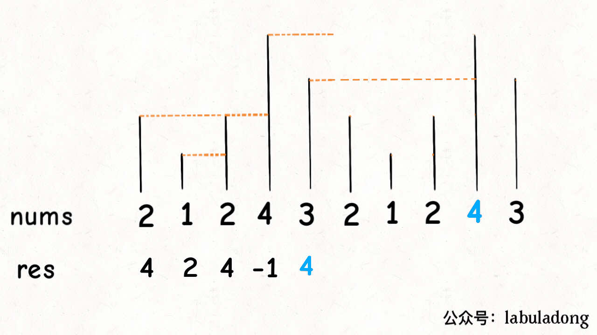

# 单调栈
- **抽象成排队问题**


- **抽象成代码**
```C++
vector<int> nextGreaterElement(vector<int> &nums) {
    vector<int> result(nums.size());
    stack<int> s;
    for (int i = nums.size() - 1; i >= 0; --i) {
        //矮个子出栈,反正不出也被高个子挡住了
        while (!s.empty() && nums[i] >= s.top())
            s.pop();
        //如果当前里面还有元素，肯定比目前元素高，没有的话就-1
        result[i] = s.empty() ? -1 : s.top();
        //把当前元素加入栈
        s.push(nums[i]);
    }
}
```

- **复杂度分析**
遍历一次数组，而且每个元素最多被pop和push进栈一次.因此时间复杂度为 **$O(n)$**.

### 处理环形数组
- 对于环形情况，一般做法是进行 **数组长度翻倍**.


- 实际可以不用构造新的双倍数组，利用 **循环数组求余法** 能模拟双倍数组.
---

### 题目练习
- **739 每日温度**
```C++
class Solution {
public:
    //抽象成单调栈问题
    //高矮个子排队视野问题
    vector<int> dailyTemperatures(vector<int>& temperatures) {
        vector<int> result(temperatures.size());
        stack<tem_day> s;
        for (int i = temperatures.size() - 1; i >= 0; --i) {
            while (!s.empty() && temperatures[i] >= s.top().first) 
                s.pop();
            result[i] = s.empty() ? 0 : (s.top().second - i);
            s.push(make_pair(temperatures[i], i));
        }
        return result;
    }

private:
    typedef pair<int, int> tem_day;
};
```

- **503 下一个更大的元素II**
```C++
class Solution {
public:
    //求余法模拟双倍数组解决环形问题
    vector<int> nextGreaterElements(vector<int>& nums) {
        int n = nums.size();
        vector<int> result(nums.size());
        stack<int> s;
        for (int i = n * 2 - 1; i >= 0; --i) {
            while (!s.empty() && nums[i % n] >= s.top())
                s.pop();
            result[i % n] = s.empty() ? -1 : s.top();
            s.push(nums[i % n]);
        }
        return result;
    }
};
```

- **496 下一个最大的元素 I**
```C++
class Solution {
public:
    vector<int> nextGreaterElement(vector<int>& nums1, vector<int>& nums2) {
        vector<int> ans;
        unordered_map<int,int> umap;
        stack<int> sta;
        for(int i: nums2) {
            while(!sta.empty() && sta.top() < i ) {
                umap[sta.top()] = i; 
                xxw4sta.pop();
            }
            sta.push(i);
        }
        for(int i: nums1) {
            int t = umap[i];
            if(t) ans.push_back(t);
            else ans.push_back(-1);
        }
        return ans;
    }
};
```

- **316 去除重复字母**
```C++
class Solution {
public:
    string removeDuplicateLetters(string s) {
        vector<int> cnt(26, 0);         //记录出现次数
        vector<int> vis(26, 0);         //记录是否进栈
        for (char c : s) cnt[c - 'a']++;
        string result;

        for (char c : s) {
            /* 如果没有进入过栈,启动下面操作 */
            if (!vis[c - 'a']) {
                while (!result.empty() && result.back() > c) {
                    /* 当前的栈顶元素比要加入的大,如果后面还会出现,可以先出,否则不能出去 */
                    if (cnt[result.back() - 'a']) {
                        vis[result.back() - 'a'] = 0;
                        result.pop_back();
                    }
                    else {
                        break;
                    }
                }
                /* 入栈标记 */
                vis[c - 'a'] = 1;
                result.push_back(c);z
            }
            /* 用一次减少一次 */
            cnt[c - 'a'] --;
        }

        return result;
    }
};
```