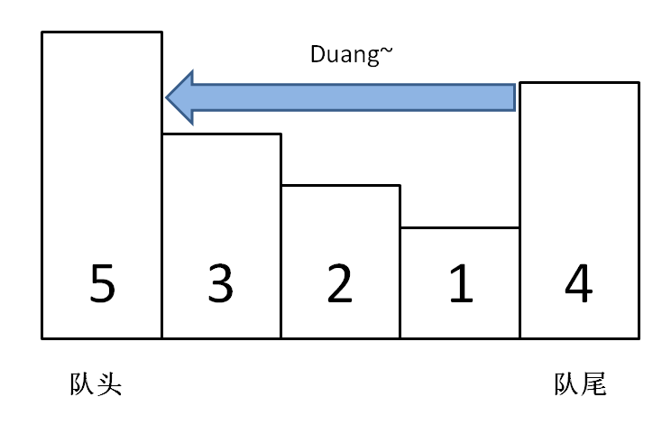

# 单调队列
- 加入队列的时候从后面加入，把比当前小的元素全给删了，反正他们是旧的，下次找最大也轮不到他们.


- **239 滑动窗口的最大值**
```C++
struct MyQueue{
public: 
    //去掉比当前小的    
    void push(int n) {
        while (!l.empty() && l.back() < n)
            l.pop_back();
        l.push_back(n);
    }

    int getMax() {
        return l.front();
    }

    //不保证n还在队列里面是大佬
    void pop(int n) {
        if (n == l.front())
            l.pop_front();
    }

private:
    list<int> l;
};

class Solution {
public:
    vector<int> maxSlidingWindow(vector<int>& nums, int k) {
        vector<int> result;
        MyQueue q;
        int i = 0;
        //填充窗口
        while (i < k) 
            q.push(nums[i++]);
        result.push_back(q.getMax());

        //窗口移动
        while (i < nums.size()) {
            q.pop(nums[i - k]);
            q.push(nums[i]);
            result.push_back(q.getMax());
            ++i;
        }

        return result;   
    }
};
```