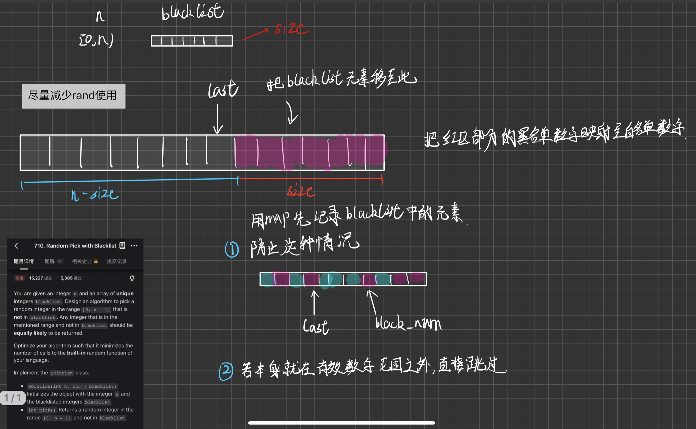

# 数据结构设计
- **380 实现随机集合**
```C++
class RandomizedSet {
    /*
    哈希表记录对应索引,删除的时候和最后一个元素交换再删除,并更新对应的索引
    */
public:
    RandomizedSet() {}
    
    bool insert(int val) {
        if (value_index.count(val))
            return false;
        value_index[val] = vec.size();
        vec.push_back(val);
        return true;
    }
    
    bool remove(int val) {
        if (!value_index.count(val))
            return false;
        int del_index = value_index[val];
        int back = vec.back();
        swap(vec[del_index], vec.back());       //交换
        vec.pop_back();                         //被换到后面的删除
        value_index[back] = del_index;          //更新索引
        value_index.erase(val);                 //删除原有元素,适合数组为1的情况
        return true;
    }
    
    int getRandom() {
        return vec[rand() % vec.size()];
    }

private:
    unordered_map<int, int> value_index;
    vector<int> vec;
};
```

- **710 黑名单中的随机数**
```C++
class Solution {
    /*
     * 构建映射
     * 将不合法的元素映射至合法元素
     * 不用真的建立数组,因为元素太多了
     */
public:
    Solution(int n, vector<int>& blacklist) {
        for (int black : blacklist)
            records[black] = -1;

        size_ = n - blacklist.size();          //合法元素范围
        int last = n - 1;
        for (int black : blacklist) {
            if (black >= size_)                //本身就不在合法区间的范围
                continue;
            while (records.count(last))
                last--;
            records[black] = last--;            //不合法元素映射至合法元素
        }
    }
    
    int pick() {
        int result = rand() % size_;
        if (records.count(result))
            return records[result];
        return result;
    }

private:
    unordered_map<int, int> records;
    int size_;                                 
};
```


---

**总结**
- 高效,等概率存取需要使用到数组作为容器.
- 想要删除元素先把元素和最后一个元素交换,再删除.
