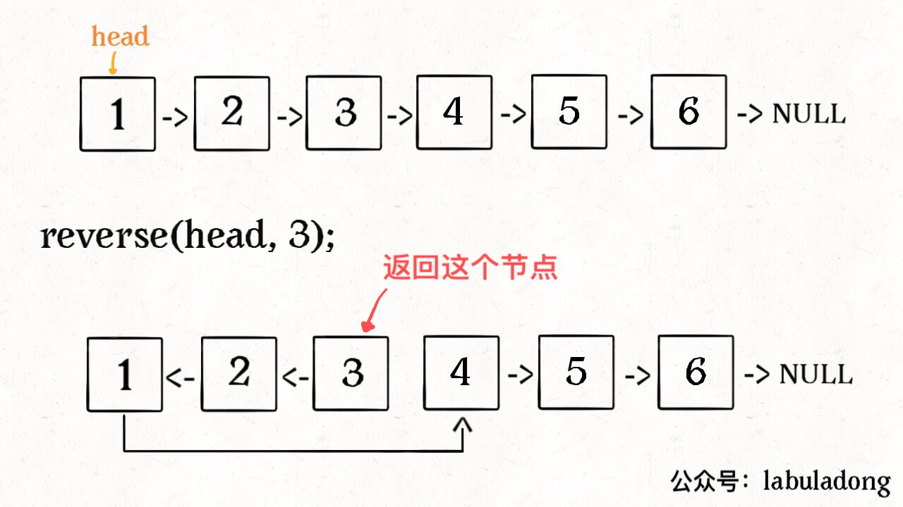

# 链表问题
### 翻转整个链表(A1)
```C++
TreeNode* reverse(TreeNode *head) {
    if (head->next == nullptr) //递归出口
        return head;
    TreeNode *last = reverse(head->next); //递归至后面结点
    head->next->next = head; //进行反转
    head->next = nullptr; //链表尾指向nullptr
    return last; //反转之后尾变头,返回新的头结点
}
```

---

### 翻转链表前n个结点(A2 -> A1之进阶)
```C++
ListNode *sc = nullptr;
ListNode* reverse_n(ListNode *head, int n) {
    if (n == 1) {
        sc = head->next;
        return head;
    }
    ListNode *last = reverse_n(head->next, n - 1);
    head->next->next = head;
    head->next = sc;
    return last;
}
```

---



---

### 翻转区间链表 (A3 -> A2之进阶)
```C++
class Solution {
public:
    ListNode* reverseBetween(ListNode* head, int left, int right) {
        if (left == 1) {
            return reverse_n(head, right);
        }
        head->next = reverseBetween(head->next, left - 1, right - 1); //巧妙一步
        return head;
    }

private:
    ListNode* reverse_n(ListNode *head, int n) {
        if (n == 1) {
            sc = head->next;
            return head;
        }
        ListNode *last = reverse_n(head->next, n - 1);
        head->next->next = head;
        head->next = sc;
        return last;
    }

private:
    ListNode *sc = nullptr;
};
```

---

### 迭代翻转整个链表(K1)
```C++
ListNode* reverse(ListNode *head) {
    ListNode *pre = nullptr, *cur = head, *nxt = head;
    while (cur != nullptr) {
        //翻转结点
        nxt = cur->next;
        cur->next = pre;
        // 指针更新
        pre = cur;
        cur = next;
    }
    //翻转之后的头结点
    return pre;
}
```

---

### 翻转a到b之间的结点(K2 -> K1之进阶)
```C++
// 只需将while条件改变一下即可
ListNode* reverse(ListNode *a, ListNode *b) {
    ListNode *pre = nullptr, *cur = a, *nxt = a;
    while (cur != b) {
        nxt = cur->next;
        cur->next = pre;
        pre = cur;
        cur = nxt;
    }
    return pre;
}
```

---

### K个一组翻转链表(K3 -> K2之进阶)
```C++
class Solution {
public:
    ListNode* reverseKGroup(ListNode* head, int k) {
        //递归出口
        if (head == nullptr)
            return head;

        //检查是否成一组
        ListNode *a = head, *b = head;
        for (int i = 0; i < k; ++i) {
            if (b == nullptr)
                return head;
            b = b->next;
        }

        ListNode *newHead = reverseAtoB(a, b); //部分翻转
        a->next = reverseKGroup(b, k); //将后面翻转的连接起来

        return newHead; //返回新的头部
    }

private:
    ListNode* reverseAtoB(ListNode *a, ListNode *b) {
        ListNode *pre = nullptr, *cur = a, *next = a;
        while (cur != b) {
            next = cur->next;
            cur->next = pre;
            pre = cur;
            cur = next;
        }
        return pre;
    }
};
```

---

### 回文串问题
- **寻找回文串就要中间向两边进行拓展**
```C++
string palindrome(string& s, int l, int r) {
    while (l >= 0 && r < s.size() && s[l] == s[r]) {
        l--;
        r++;
    }
    return s.substr(l + 1, r - l - 1);
}
```

- **判断回文串就直接两边向中间靠拢**
```C++
bool isPalindrome(string &s) {
    int left = 0, right = s.size() - 1;
    while (left < right) {
        if (s[left] != s[right])
            return false;
        left++;
        right--;
    }
    return true;
}
```

- **回文链表判断**
```C++
//解法一
class Solution {
public:
    bool isPalindrome(ListNode* head) {
        left = head;
        return reverse(head);
    }

    bool reverse(ListNode *head) {
        if (head == nullptr)
            return true;
        bool result = reverse(head->next);           //后序遍历
        result = result && (left->val == head->val); //此时是相对应尾部那个
        left = left->next;                           //同步前进
        return result;
    }

private:
    ListNode *left;
};

//解法二
class Solution {
public:
    bool isPalindrome(ListNode* head) {
        ListNode *slow = head, *fast = head;
        //双指针找到中间结点
        while (fast != nullptr && fast->next != nullptr) {
            slow = slow->next;
            fast = fast->next->next;
        }
        //判断奇偶，如果奇数则向前一位
        if (fast) {
            slow = slow->next;
        }
        //后半部分翻转
        ListNode *latter = reverse(slow);
        //前后比较
        while (latter) {
            if (head->val != latter->val)
                return false;
            head = head->next;
            latter = latter->next;
        }
        return true;
    }

    //反转函数
    ListNode* reverse(ListNode *head) {
        ListNode *pre = nullptr, *cur = head, *nxt = head;
        while (cur) {
            nxt = cur->next;
            cur->next = pre;
            pre = cur;
            cur = nxt;
        }
        return pre;
    }
};
```